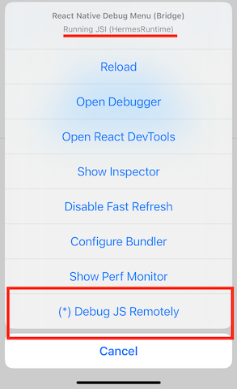

# react-native-devsettings

[](https://www.npmjs.com/package/react-native-devsettings)
[](https://www.npmjs.com/package/react-native-devsettings)
[](https://www.npmjs.com/package/react-native-devsettings)


<!-- [](https://www.npmjs.com/package/react-native-devsettings) -->

Enable react-native-debugger and chrome debugger on Hermes

## Installation

```sh
npm install react-native-devsettings
```

or

```sh
yarn add react-native-devsettings
```

## Usage

Add the following line to your `App.tsx` file

```js
import 'react-native-devsettings';
```

Execute `cmd+d` or `cmd+m` on your simulator/emulator and select `(*) Debug JS Remotely`


